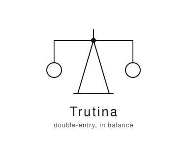
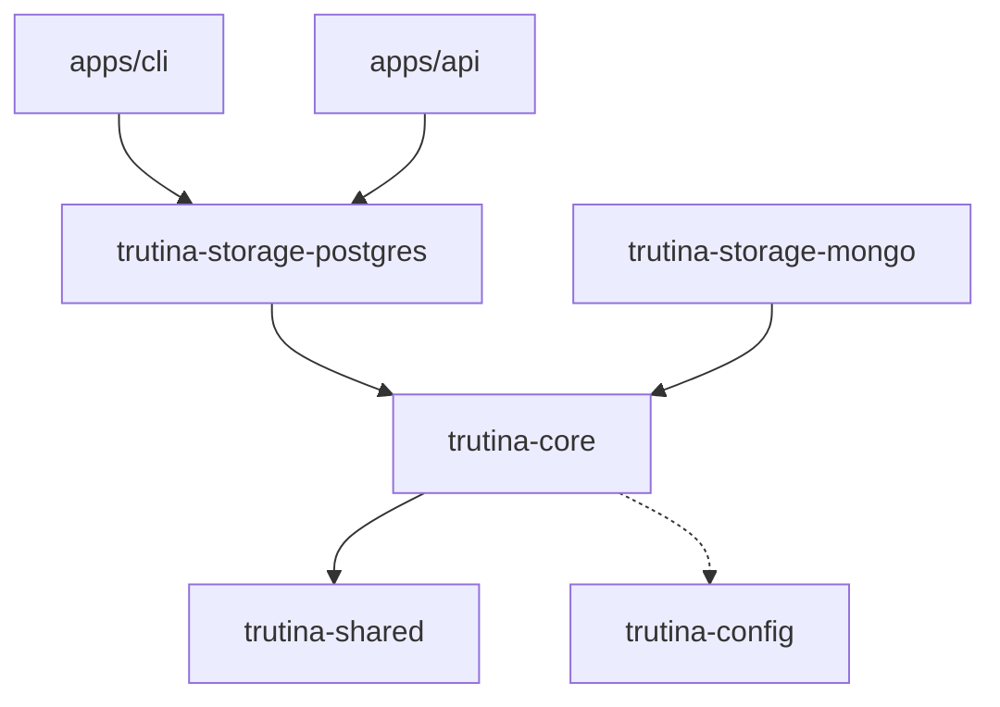

<p align="center">
  
</p>

<p align="center">
  <em>A Python double-entry bookkeeping engine, built as a uv workspace.</em>
</p>

[](https://github.com/Mofathy183/trutina/actions/workflows/ci.yml)


## Quick Start

```bash
uv sync --all-packages
uv run pytest -m unit
```

## Repo Map



`trutina-storage-mongo` still implements the same repository contracts and has its own
CI lane, but neither `apps/cli` nor `apps/api` depends on it today — see Packages & Apps
below.

## Packages & Apps

- **`trutina-core`** — the accounting domain: validated schemas, three complete
  services (`AccountService`, `JournalService`, `PostingService`), and storage-agnostic
  repository contracts. Zero storage or transport awareness, enforced by import-linter.
  See `packages/core/README.md` / `CONTEXT.md`.
- **`trutina-storage-postgres`** — the storage backend `apps/cli` and `apps/api`
  actually depend on today: SQLAlchemy async + `asyncpg` implementations of the three
  repository contracts, plus Alembic migrations. See `packages/storage-postgres/README.md`
  / `CONTEXT.md`.
- **`trutina-storage-mongo`** — the original MongoDB/Beanie adapter. Still implements the
  same contracts and is tested independently in its own CI lane, but is no longer a
  declared dependency of either presentation app since the Postgres cutover. See
  `packages/storage-mongo/README.md` / `CONTEXT.md`.
- **`trutina-config`** — typed, environment-driven settings (`Settings`/`TestSettings`,
  `MongoSettings`, `PostgresSettings`, `ApiSettings`). Depends on nothing else in the
  workspace. See `packages/config/README.md` / `CONTEXT.md`.
- **`trutina-shared`** — the lowest-level package: reusable account-validation rules and
  the shared `ErrorCode`/`AppError`/`ValidationAppError` model. Depends only on
  `pydantic`. See `packages/shared/README.md` / `CONTEXT.md`.
- **`apps/cli`** — a Typer/Rich terminal app plus a persistent interactive shell, sitting
  on `trutina-core` through `trutina-storage-postgres`. See `apps/cli/README.md` /
  `CONTEXT.md`.
- **`apps/api`** — a FastAPI HTTP layer over the same domain services, following a fixed
  Router → Mapper → Handler → Presenter pipeline per feature. See `apps/api/README.md` /
  `CONTEXT.md`.

## Development

```bash
uv sync --all-packages
uv run pytest -m unit
uv run alembic -c packages/storage-postgres/alembic.ini upgrade head
uv run pytest -m integration   # requires PostgreSQL; see Known Gaps in PROJECT_CONTEXT.md
uv run ruff check && uv run ruff format
uv run ty check
uv run lint-imports
```

Convenience scripts: `tools/bootstrap.sh` (sync everything), `tools/fix.sh` (auto-fix
formatting/lint), `tools/pre-push.sh` (the fast local gate CI also runs first),
`tools/docker-build.sh` / `tools/docker-smoke.sh` (build and smoke-test the API image
against a real PostgreSQL container).

Root `compose.yml` / `compose.dev.yml` currently provision only MongoDB for local
development, even though `apps/api` depends on `trutina-storage-postgres` — see
`PROJECT_CONTEXT.md` for this open gap. `.env.example` / `.env.test.example` already
carry both `TRUTINA_MONGO__*` and `TRUTINA_POSTGRES__*` variables.

## See Also

- `ARCHITECTURE.md` — dependency direction, layer boundaries
- `ROADMAP.md` — what's confirmed missing or unresolved
- `PROJECT_CONTEXT.md` — cross-package conflicts and open flags
- `AGENTS.md` — tooling commands, repo layout, agent-facing conventions

## Contributing

Keep changes scoped to the package/app they belong to. Update that package's own
README/CONTEXT when its structure or maturity changes — do not let root docs drift into
re-describing package internals. Run `tools/pre-push.sh` before pushing.

## License

No license file is present in the repository yet.
