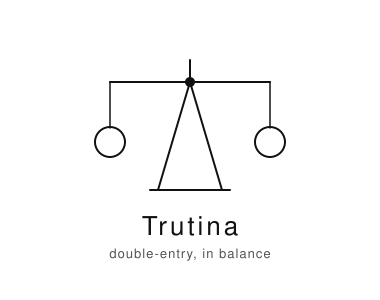
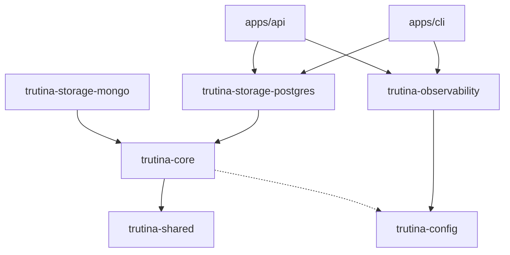

<p align="center">
  
</p>

<p align="center">
  <em>A Python double-entry bookkeeping engine, built as a uv workspace.</em>
</p>

[](https://github.com/Mofathy183/trutina/actions/workflows/ci.yml)


## Quick Start

```bash
uv sync --all-packages
uv run pytest -m unit
```

## Repo Map


```mermaid
flowchart TD
    CLI[apps/cli] --> STORAGE_PG[trutina-storage-postgres]
    CLI --> OBS[trutina-observability]
    API[apps/api] --> STORAGE_PG
    API --> OBS
    STORAGE_PG --> CORE[trutina-core]
    STORAGE_MONGO[trutina-storage-mongo] --> CORE
    OBS --> CONFIG[trutina-config]
    CORE --> SHARED[trutina-shared]
    CORE -.-> CONFIG
```

`trutina-storage-mongo` still implements the account, journal, and posting repository
contracts and has its own CI lane, but neither `apps/cli` nor `apps/api` depends on it
today — see Packages & Apps below. `trutina-observability` is consumed only by the two
presentation apps; every other package emits through the standard library's `logging`
module directly.

## Packages & Apps

- **`trutina-core`** — the accounting domain: validated schemas, four services
  (`AccountService`, `JournalService`, `PostingService`, `TrialBalanceService`), and
  storage-agnostic repository contracts. Zero storage, transport, or logging-framework
  awareness, enforced by import-linter. Each service logs one success event through
  stdlib `logging` on a state-changing write. See `packages/core/README.md` /
  `CONTEXT.md`.
- **`trutina-observability`** — shared logging configuration and request/command
  correlation, consumed only by `trutina-cli` and `trutina-api`. Every other package
  emits through plain `logging.getLogger(__name__)` with zero dependency on this
  package. See `packages/observability/README.md` / `CONTEXT.md`.
- **`trutina-storage-postgres`** — the storage backend `apps/cli` and `apps/api`
  actually depend on today: SQLAlchemy async + `asyncpg` implementations of the four
  repository contracts (including the trial balance aggregation), plus Alembic
  migrations. Logs connection lifecycle events and constructs its engine with
  `hide_parameters=True`. See `packages/storage-postgres/README.md` / `CONTEXT.md`.
- **`trutina-storage-mongo`** — the original MongoDB/Beanie adapter. Still implements the
  account, journal, and posting contracts and is tested independently in its own CI
  lane, but is no longer a declared dependency of either presentation app since the
  Postgres cutover. It has no trial balance implementation. See
  `packages/storage-mongo/README.md` / `CONTEXT.md`.
- **`trutina-config`** — typed, environment-driven settings (`Settings`/`TestSettings`,
  `MongoSettings`, `PostgresSettings`, `ApiSettings`, `LoggingSettings`). Depends on
  nothing else in the workspace. See `packages/config/README.md` / `CONTEXT.md`.
- **`trutina-shared`** — the lowest-level package: reusable account-validation rules and
  the shared `ErrorCode`/`AppError`/`ValidationAppError` model. Depends only on
  `pydantic`. See `packages/shared/README.md` / `CONTEXT.md`.
- **`apps/cli`** — a Typer/Rich terminal app plus a persistent interactive shell, sitting
  on `trutina-core` through `trutina-storage-postgres`, with structured JSON logging via
  `trutina-observability`. Command groups: `account`, `journal`, `posting`, plus the
  `trial-balance` command. See `apps/cli/README.md` / `CONTEXT.md`.
- **`apps/api`** — a FastAPI HTTP layer over the same domain services, following a fixed
  Router → Mapper → Handler → Presenter pipeline per feature, with correlation-id
  middleware and structured JSON logging via `trutina-observability`. Routes cover
  accounts, journal entries, postings, and `GET /trial-balance`. See `apps/api/README.md`
  / `CONTEXT.md`.

## Development

```bash
uv sync --all-packages
uv run pytest -m unit
uv run alembic -c packages/storage-postgres/alembic.ini upgrade head
uv run pytest -m integration   # requires PostgreSQL; see Known Gaps in PROJECT_CONTEXT.md
uv run ruff check && uv run ruff format
uv run ty check
uv run lint-imports
```

Convenience scripts: `tools/bootstrap.sh` (sync everything), `tools/fix.sh` (auto-fix
formatting/lint), `tools/pre-push.sh` (the fast local gate CI also runs first),
`tools/docker-build.sh` / `tools/docker-smoke.sh` (build and smoke-test the API image
against a real PostgreSQL container, including a check that structured JSON logging
with a correlation id reaches the container's output).

Root `compose.yml` / `compose.dev.yml` currently provision only MongoDB for local
development, even though `apps/api` depends on `trutina-storage-postgres` — see
`PROJECT_CONTEXT.md` for this open gap. `.env.example` / `.env.test.example` already
carry `TRUTINA_MONGO__*`, `TRUTINA_POSTGRES__*`, and `TRUTINA_LOGGING__*` variables.

## See Also

- `ARCHITECTURE.md` — dependency direction, layer boundaries
- `ROADMAP.md` — what's confirmed missing or unresolved
- `PROJECT_CONTEXT.md` — cross-package conflicts and open flags
- `AGENTS.md` — tooling commands, repo layout, agent-facing conventions

## Contributing

Keep changes scoped to the package/app they belong to. Update that package's own
README/CONTEXT when its structure or maturity changes — do not let root docs drift into
re-describing package internals. Run `tools/pre-push.sh` before pushing.

## License

No license file is present in the repository yet.
